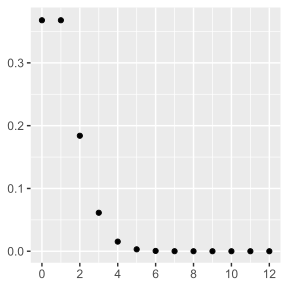
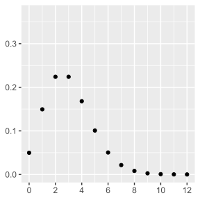
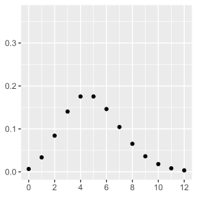

  
```{r setup, include=FALSE}
options(htmltools.dir.version = FALSE)
```

```{r refmanager, include=FALSE}
library(RefManageR)
source(here::here("helper.R"))
BibOptions(check.entries = FALSE, 
           bib.style = "authoryear", 
           style = "markdown",
           dashed = TRUE)
bib <- ReadBib("bibliography.bib")
citeopt <- list(max.names=3, longnamesfirst = FALSE)
```

```{r use-logo, echo=FALSE}
xaringanExtra::use_logo("https://raw.githubusercontent.com/fquezadae/Impact-of-Environmental-Variability-on-Harvest/088d0bab630a8da78df8a546f30138ba56324573/logo/udec2.png")
```

# Introducción

- **Regresión de Poisson** 
  - Modelo de regresión para **datos de conteo**, donde la variable dependiente representa el **número de eventos en un tiempo** o espacio específico.
  - Los datos de conteo son no negativos y discretos (0, 1, 2,...).

- Ejemplos:
  - Número de cervezas que se venden en un bar entre las 23:00 y las 00:00 horas.
  - Número de accidentes de tráfico en una intersección por día.
  - Número de llamadas telefónicas recibidas por un centro de atención al cliente por minuto.

---

# Función de Probabilidad

El modelo de probabilidad esta dado por:

- **Función de Probabilidad:**
  $$P(Y = y) = \frac{e^{-\lambda} \lambda^y}{y!}, \quad y = 0, 1, 2, ...$$

donde $Y$ es variable discreta que representa el número de eventos; $\lambda$ es la <b>media</b>.


---

# Modelo de regresion

Para estimar un modelo poisson:

- **Relación entre Media y Variables Independientes:** 
Generalmente uno asume que 
  $$\lambda = E(Y|X) = e^{X'\beta}$$
  donde $X = (X_1, X_2, ..., X_k)'$ es un vector de variables explicativas.
-  Es decir, el modelo de Poisson es log-lineal $\ln(\lambda_i)=\beta'\mathbf{X}$
- **Supuesto Clave:** $Y$ sigue una distribución de Poisson con media $\lambda$, donde $\lambda$ es función de $X$. Es decir,  $Y\sim\text{Poisson}(\lambda(X))$

---

# Modelo de regresion

En Poisson log-lineal $\ln(\lambda_i)=\beta'\mathbf{X}$:

- **Coeficientes ($\beta_j$):**
    - Representan el cambio en el logaritmo de la media de $Y$ por un cambio de una unidad en $X_j$, manteniendo constantes las demás variables.
    - $\exp(\beta_j)$ representa el cambio multiplicativo en la media de $Y$ con un cambio unitario en $X_j$.
- **Ejemplo:** Si $\exp(\beta_1) = 1,2$, un aumento de una unidad en $X_1$ se asocia con un aumento del 20% en la media de $Y$.


---

# Función de Verosimilitud

Considerando la función de probabilidad, la verosimilitud es:

$$L(\beta) = \prod_{i=1}^{n} \frac{e^{-\lambda_i} \lambda_i^{y_i}}{y_i!}$$

donde $\lambda_i = e^{X_i'\beta}$.

y la **Log-Verosimilitud** es:

$$\ell(\beta) = \sum_{i=1}^{n} (y_i X_i'\beta - e^{X_i'\beta} - \ln(y_i!))$$


---

# Inferencia

- Los **Errores Estándar** se calculan a partir de la matriz de información de Fisher.

- Y las **Pruebas de Hipótesis** se pueden realizar mediante pruebas t para la significancia individual de los coeficientes y pruebas de Wald para restricciones conjuntas.

- Respecto a los **Intervalos de Confianza,** se pueden construir intervalos de confianza para los coeficientes de forma usual.

---

# Sobredispersión

La sobredispersión ocurre cuando la varianza de $Y$ es mayor que su media, violando el supuesto de Poisson (**equisdispersión**).
  
- **Causas:**
  - Heterogeneidad no observada.
  - Omisión de variables relevantes.
  - Eventos correlacionados.

- **Consecuencias:**
  - Sesgo en estimaciones de errores estándar.
  - Pruebas de hipótesis incorrectas.
  
---

# Sobredispersión

## Soluciones:

- **Regresión Binomial Negativa:** Modelo alternativo para permitir sobredispersión. 
  - En este caso la varianza es $Var(y_i) = \mu + \alpha \mu^p_i$, donde $p={1,2}$ (Tipo 1 $p=1$, y en Tipo 2 es $p=2$) 
  - $\alpha$ es el parametro que mide la dispersión.
  
- **Estimación Robusta:** Ajuste de errores estándar para sobredispersión.


---

# Ejemplo a mano

Tenemos diez puntos de datos de una distribución Poisson, pero ¿cuál es el parámetro λ de la distribución?

$$
y = \{2, 0, 1, 2, 2, 2, 0, 2, 1, 1\}
$$

$$
f(y \mid \lambda) = \frac{e^{-\lambda}\lambda^y}{y!}
$$

<div style="display:flex; gap:1rem; justify-content:space-between;">
  <div style="flex:1; text-align:center;">
    <p>$$\lambda=1$$</p>
    <!-- chunk R: -->
    ```{r, echo=FALSE, out.width="100%"}
    
    ```
  </div>
  <div style="flex:1; text-align:center;">
    <p>$$\lambda=3$$</p>
    ```{r, echo=FALSE, out.width="100%"}
    
    ```
  </div>
  <div style="flex:1; text-align:center;">
    <p>$$\lambda=5$$</p>
    ```{r, echo=FALSE, out.width="100%"}
    
    ```
  </div>
</div>

---

# Ejemplo a mano

Tenemos diez puntos de datos de una distribución Poisson, pero ¿cuál es el parámetro $\lambda$ de la distribución?  

$$\mathbf{y} = \{ 2, 0, 1, 2, 2, 2, 0, 2, 1, 1 \}$$  

$$
\begin{aligned}
L(\lambda \mid \mathbf{y}) & = \prod_{i = 1}^n \frac{e^{-\lambda} \lambda^{y_i} }{y_i!} 
= \frac{e^{-n \lambda} \lambda^{\sum_{i=1}^n y_i}}{\prod_{i = 1}^n y_i!} \\
\ln L(\lambda \mid \mathbf{y}) & = -n \lambda + \ln \lambda \sum_{i = 1}^n y_i - \sum_{i = 1}^n \ln (y_i!) \\
\frac{\partial \ln L(\lambda \mid \mathbf{y})}{\partial \lambda} & = -n + \frac{1}{\lambda} \sum_{i = 1}^n y_i \\
\frac{\partial \ln L(\lambda \mid \mathbf{y})}{\partial \lambda} & = 0 ~~ \Rightarrow ~~ 
\widehat{\lambda} = \frac{1}{n} \sum_{i = 1}^n y_i = 1.3
\end{aligned}
$$

---

# Ejemplo a mano

Tenemos diez puntos de datos de una distribución Poisson, pero ¿cuál es el parámetro $\lambda$ de la distribución?  

$$\mathbf{y} = \{ 2, 0, 1, 2, 2, 2, 0, 2, 1, 1 \}$$  

$$
\begin{aligned}
L(\lambda \mid \mathbf{y}) & = \prod_{i = 1}^n \frac{e^{-\lambda} \lambda^{y_i} }{y_i!} 
= \frac{e^{-n \lambda} \lambda^{\sum_{i=1}^n y_i}}{\prod_{i = 1}^n y_i!} 
= \frac{e^{-10 \lambda} \lambda^{13}}{32}\\
\ln L(\lambda \mid \mathbf{y}) & = -n \lambda + \ln \lambda \sum_{i = 1}^n y_i - \sum_{i = 1}^n \ln (y_i!) 
= -10 \lambda + 13 \ln \lambda - 3.47
\end{aligned}
$$

---

# Software 

  - Stata: `rpoisson`
  - R: `glm` 

---

class: smaller

# Ejemplo en R: Poisson

```{r, echo=TRUE, results='hide', message=FALSE, warning=FALSE}
# 1. Datos a usar
set.seed(123)
n      <- 1000
x      <- rnorm(n, mean = 0, sd = 1)
b0     <- 1
b1     <- 0.5
lambda <- exp(b0 + b1 * x)
y      <- rpois(n, lambda)      # (ej., número crímenes)
```

---

# Histograma de Y

```{r, echo=FALSE, results=TRUE, message=FALSE, warning=FALSE}
# Librerías
library(ggplot2)

# Gráfico moderno del histograma
ggplot(data.frame(y = y), aes(x = y)) +
  geom_histogram(
    bins = 30,
    aes(y = ..density..),
    fill = "#113B63",   # Azul UdeC
    color = "white",
    alpha = 0.9,
    linewidth = 0.4
  ) +
  geom_density(
    color = "#F59F18",  # Dorado UdeC
    linewidth = 1.2,
    linetype = "solid"
  ) +
  labs(
    title = "Distribución de Conteos (Crímenes)",
    x = "Número de eventos (y)",
    y = "Densidad"
  ) +
  theme_minimal(base_size = 14) +
  theme(
    plot.title = element_text(face = "bold", size = 16, color = "#113B63", hjust = 0.5),
    axis.title.x = element_text(size = 13, face = "bold", margin = margin(t = 10)),
    axis.title.y = element_text(size = 13, face = "bold", margin = margin(r = 10)),
    axis.text = element_text(color = "gray20"),
    panel.grid.major = element_line(color = "gray85"),
    panel.grid.minor = element_blank(),
    plot.background = element_rect(fill = "white", color = NA)
  )
```

---

class: smaller

# Estimación por Máxima Verosimilitud

```{r, echo=TRUE, results=FALSE, message=FALSE, warning=FALSE}
library(maxLik)

ch_ll<- function(params) {
  b0 <- params[1]
  b1 <- params[2]
  xb <- b0 + b1 * x
  mu <- exp(xb)
  ll <- -mu + y * xb - lfactorial(y)
  return(sum(ll))
}

mle_poisson <- maxLik(logLik=ch_ll, start=c(0.1, 0.1))
summary(mle_poisson)
```

---

# Estimación por Máxima Verosimilitud

```{r, echo=FALSE, results=TRUE, message=FALSE, warning=FALSE}
summary(mle_poisson)
```

---

class: smaller

# Comparación con glm

```{r, echo=TRUE, results=TRUE, message=FALSE, warning=FALSE}
glm(y ~ x, family = poisson(link = "log"))
```

---


layout: false

class: inverse, center, middle

# ¡Muchas gracias!

<span style="font-weight:700;">Felipe J. Quezada-Escalona</span>  

Department of Economics


<span style="color:#f59f18;">¿Preguntas?</span>

```{r message=FALSE, warning=FALSE, include=FALSE}
pagedown::chrome_print("09-Datos-Contables.html", output = "09-Datos-Contables.pdf")
```

